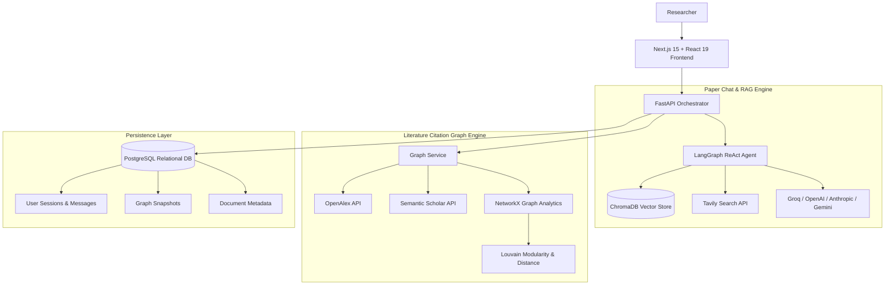

# Resector: Local-First Academic Research Companion

Resector is an advanced, local-first research workstation engineered to transform how researchers interact with scientific literature, citations, and the web. By combining a decoupled Frontend/Backend architecture with agentic RAG (Retrieval-Augmented Generation), recursive citation graph modeling, and customizable AI personas, Resector enables researchers to conduct rigorous deep-dive investigations with high precision, grounded inline citations, and visual literature cartography.

---

## 🚀 Key Features

### 1. 50-Paper Recursive Citation Network & Community Graph
- **Multi-Source Academic Traversal**: Queries OpenAlex (250M+ scholarly works) and Semantic Scholar API with ArXiv/DOI matching and Tavily scholarly web fallback to reliably aggregate 50–60 connected peer-reviewed papers.
- **Bibliographic Coupling & Cross-Citations**: Detects shared references (Jaccard similarity ≥ 0.035) and cross-citations across all candidate works, generating 800+ interconnected chain links rather than isolated star graphs.
- **Louvain Modularity Clustering**: Automatically partitions citation networks into 4–8 distinct thematic communities, assigning distinct vibrant color palettes (Orange, Green, Purple, Blue, Red, Brown, Yellow, Teal).
- **Proximity Distance & Importance Metrics**: Root paper pinning, multi-hop shortest path graph distances, and normalized citation/reference importance scores.
- **Interactive D3 Physics Canvas**: Real-time `Titles` density threshold slider, `Importance` size scaling with live D3 reheat simulation, layout presets (`Force Atlas`, `Clusters`, `Years`), and `Export GEXF` for Gephi analysis.

### 2. Immersive Paper Chat & Grounded RAG Agent
- **Multi-Document PDF Indexing**: Upload and batch process multiple scientific PDFs with PyMuPDF text chunking, local vector embedding, and session-scoped ChromaDB collections.
- **LangGraph ReAct Agent Loop**: Iteratively reasons whether to query local paper vectors or search the live web via Tavily for contemporary verification.
- **Complete Conversation Lifecycle**: Create named research sessions, delete entire sessions with cascading file cleanup, clear chat history, delete single messages, copy markdown outputs, and filter session history.
- **Starter Analytical Prompts**: Instant 1-click queries for core finding synthesis, methodological critiques, metric comparisons, and future work extraction.
- **Isolated Viewport Layout**: Pinned header and footer input bar with independently scrolling conversation feed.

### 3. Core Academic Analysis Tools
- **Methodology Sifter**: Structured extraction pipeline extracting core research questions, sample sizes, experimental setups, and fatal methodological flaws.
- **Persona Spectrum (Critique Tool)**: 5-stage critical tone spectrum—from Supportive Peer to Hostile Reviewer 2.
- **Jargon Simplifier**: Layered technical translation bridging dense mathematical and scientific terminology to intuitive analogies.
- **Research Archive**: Chronological search, tag filtering, and inspection of past analytical queries.

---

## 🏗️ Architecture & Data Flow



---

## 🐳 Deployment

Resector uses a **single all-in-one Docker container** for lightweight deployment. One command starts PostgreSQL, ChromaDB, the FastAPI backend, and the Next.js frontend — all managed by `supervisord`.

```bash
docker-compose up --build
# Access at http://localhost:3000
```

For local development without Docker (running each service separately), see [SETUP.md](./SETUP.md).

---

## 📂 File Directory & Purpose

### 📁 Root
- `docker-compose.yml`: Single-container orchestration (all services in one container).
- `Dockerfile.all-in-one`: Builds PostgreSQL, ChromaDB, FastAPI backend, and Next.js frontend into one image.
- `supervisord.conf`: Process manager configuration for the all-in-one container.
- `.dockerignore`: Build optimization to exclude unnecessary files.
- `CLAUDE.md`: AI assistant operational manual and quick commands.
- `PROJECT.md`: Comprehensive project blueprint, architecture, and feature index.
- `README.md`: Public-facing engineering documentation and architecture diagrams.
- `SETUP.md`: Detailed environment configuration and onboarding instructions.

### 📁 backend/
- `main.py`: FastAPI server with Depends-based DB session management, lifespan event handler, explicit CORS origins, and structured logging. Endpoints: chat sessions, message CRUD, PDF uploads, research tools, and graph snapshots.
- `config.py`: Centralized environment configurations with env var priority and rate limit error handlers.
- `database.py`: SQLAlchemy 2.0 ORM models (`UserSession`, `ChatMessage`, `Document`, `ResearchLog`, `GraphSnapshot`), timezone-aware datetimes, cascade delete relationships, and thread-safe ChromaDB client singleton.
- `provider_factory.py`: Pluggable LLM factory supporting Groq, OpenAI, Anthropic, and Google Gemini with Pydantic API key validation.
- `tools.py`: Academic research tools (Sifter, Critique, Jargon) and Tavily web search integration with proper error logging.
- `requirements.txt`: Python package specifications.
- **📁 services/**
  - `graph_service.py`: High-throughput citation engine (OpenAlex, Semantic Scholar, NetworkX, Louvain clustering, Bibliographic coupling) with structured logging and stable hashing.
  - `rag_agent.py`: LangGraph ReAct agent loop with enum-based role comparison for chat history and retryable-error-only retry logic.
  - `pdf_processor.py`: Async-safe PDF extraction (run_in_executor), semantic chunking, ChromaDB vector indexing, and corrupt/password-protected PDF handling.

### 📁 frontend/
- `package.json`: Next.js 15, React 19, Tailwind CSS, Lucide icons, and `react-force-graph-2d`.
- **📁 src/app/**
  - `page.tsx`: Main workspace container with fixed viewport, sidebar switcher, and theme provider.
  - `layout.tsx`: Root HTML layout.
  - `globals.css`: Academic high-contrast design system and CSS variables.
  - **📁 paper-chat/**
    - `page.tsx`: Immersive paper chat interface, starter prompt cards, session management, proper interval cleanup, and 50-Paper network integration.
- **📁 src/components/**
  - `PaperGraphView.tsx`: Interactive 50-Paper citation graph canvas with D3 physics reheat, Louvain community clusters, titles/importance sliders, and GEXF export.
  - `SifterTool.tsx`: UI for structured research methodology extraction with API key pre-validation.
  - `CritiqueTool.tsx`: UI for the 5-stage Persona Spectrum academic critique with API key pre-validation.
  - `JargonTool.tsx`: UI for technical jargon translation with API key pre-validation.
  - `ResearchHistory.tsx`: Historical query archive using GET endpoint with query params and error states.
  - `SettingsDrawer.tsx`: User API key vault with guarded JSON.parse, Escape key close, and backdrop click-to-close.
  - `ThemeToggle.tsx`: Synchronized Dark/Light mode switcher with SSR-safe mounting.
