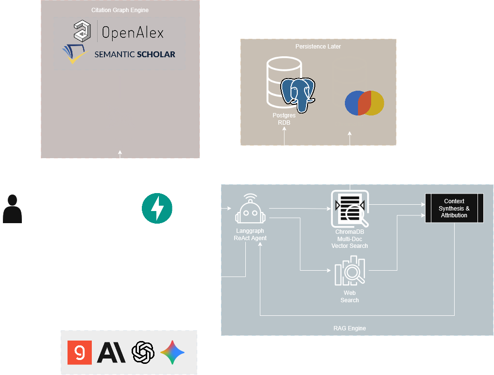

# Resector

Resector is an advanced, local-first academic research workstation designed to augment scientific inquiry and literature exploration. By integrating agentic retrieval-augmented generation (RAG), multi-document state management, recursive citation graph cartography, and real-time scholarly search, Resector transforms static PDF libraries into an interactive, multi-dimensional knowledge ecosystem.

The system is engineered to handle the rigor of academic workflows—providing tools for structured methodology extraction, adversarial hypothesis stress-testing through persona spectrums, thematic Louvain community clustering, and semantic synthesis across complex document corpora.

---

## System Architecture

Resector employs a decoupled architecture designed for scalability, low latency, and complete data sovereignty. The orchestration layer operates independently from vector and relational persistence layers, ensuring sensitive research papers remain locally managed while interfacing with state-of-the-art LLMs and open academic knowledge graphs.

### Architecture Overview

---

## Engineering Core Components

### 1. 50-Paper Recursive Citation Graph Engine

- **Multi-Source Academic Traversal**: Queries OpenAlex (250M+ scholarly works) and Semantic Scholar with ArXiv/DOI fallback to construct complete citation trees starting from any uploaded PDF or query title.
- **Bibliographic Coupling & Cross-Citations**: Automatically discovers shared reference overlap (Jaccard $\ge 0.035$) across all candidate papers, producing 800+ interconnected chain links rather than isolated star networks.
- **Louvain Modularity Community Detection**: Clusters papers into 4–8 distinct thematic communities, color-coding nodes with vibrant academic palettes (Orange, Green, Purple, Blue, Red, Brown, Yellow, Teal).
- **Interactive D3 Physics Canvas**: Built with `react-force-graph-2d`, featuring live simulation reheating on slider interactions, dynamic title density thresholds, importance sizing, multi-line centered label pills, and GEXF export.

### 2. Immersive Grounded Paper Chat

- **Session & Message Lifecycle Management**: Full control to create sessions, delete entire sessions with cascading file cleanup, clear chat histories, and delete individual messages with 1-click markdown copying.
- **Analytical Starter Cards**: Pre-configured analytical prompts for rapid synthesis of core findings, methodology critiques, empirical benchmarks, and future work.
- **Isolated Viewport Design**: Static header and footer chat bar with an independently scrolling message feed and live document grounding indicators.

### 3. Agentic RAG Engine

- Implements a ReAct (Reason + Act) loop via LangGraph that iteratively queries local ChromaDB vectors and live web citations, enforcing grounded inline references and avoiding hallucinations.

### 4. Provider Factory Pattern

- Pluggable abstraction layer enabling hot-swapping across Groq (Llama 3.3 70B), OpenAI (GPT-4o), Anthropic (Claude 3.5 Sonnet), and Google Gemini without altering agent orchestration logic.

---

## Key Research Modules

| Module                        | Purpose                                  | Key Capabilities                                                                           |
| :---------------------------- | :--------------------------------------- | :----------------------------------------------------------------------------------------- |
| **50-Paper Citation Network** | Visual literature cartography            | Louvain community detection, bibliographic coupling, proximity distance, GEXF export       |
| **Paper Chat**                | Conversational research grounded in PDFs | Multi-doc indexing, session deletion, message deletion, copy-to-clipboard, starter prompts |
| **Methodology Sifter**        | Structured research extraction           | Extracts core research questions, sample sizes, experimental setups, and fatal flaws       |
| **Adversarial Critique**      | Persona-driven hypothesis testing        | 5-stage spectrum from Supportive Peer to Hostile Reviewer 2                                |
| **Jargon Simplifier**         | Technical translation                    | Multi-layer explanations and conceptual analogies for complex academic terminology         |
| **Research Archive**          | Audit trail of past inquiries            | Chronological search, tag filtering, and structured query history inspection               |

---

## Setup and Installation

For instructions on deploying Resector via Docker Compose or setting up the local development environment, see:

**[SETUP.md](./SETUP.md)**
