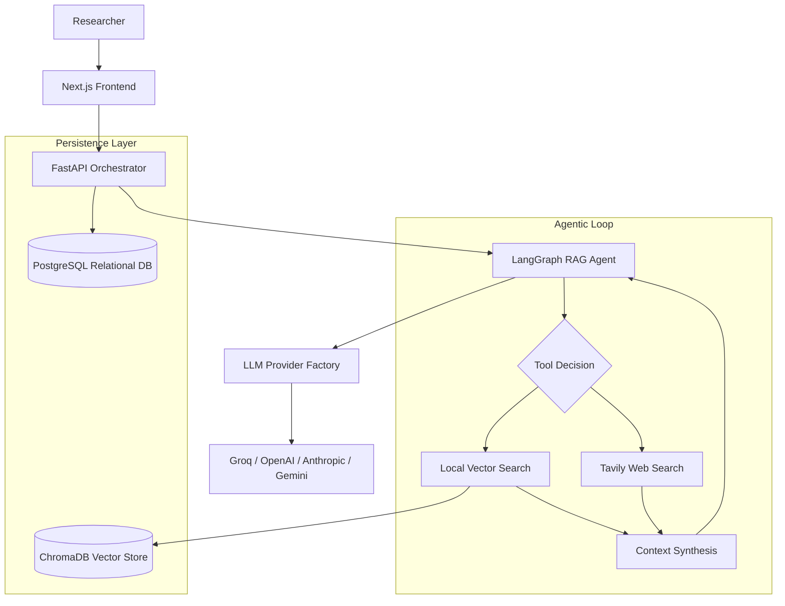

# Resector

Resector is a professional-grade, local-first research companion designed to augment the academic research workflow. By integrating agentic retrieval-augmented generation (RAG), multi-document state management, and real-time web intelligence, Resector transforms static PDF libraries into an interactive, queryable knowledge base.

The system is engineered to handle the rigor of academic inquiry, providing tools for methodology extraction, hypothesis stress-testing through adversarial personas, and semantic synthesis across diverse document sets.

## System Architecture

Resector employs a decoupled architecture designed for scalability and data sovereignty. The system separates the orchestration layer from the data persistence layer, ensuring that sensitive research data remains local while leveraging state-of-the-art LLM providers.

### High-Level Design

### Engineering Core Components

#### 1. Agentic RAG Engine
Unlike traditional RAG which relies on simple similarity searches, Resector implements a ReAct (Reason + Act) agent loop via LangGraph. The agent iteratively decides whether to query the local document store, search the web for current citations, or synthesize a final answer based on the gathered context.

#### 2. Hybrid Persistence Strategy
The system utilizes a dual-database approach to optimize for different data access patterns:
- **Relational (PostgreSQL)**: Manages session state, conversation threading, and document metadata. This ensures strict consistency for research logs and user sessions.
- **Semantic (ChromaDB)**: Stores high-dimensional embeddings of PDF chunks. This enables natural language retrieval across thousands of pages of technical text.

#### 3. Provider Factory Pattern
To avoid vendor lock-in, Resector implements a Provider Factory. This abstraction layer allows the system to hot-swap LLM providers (e.g., moving from Groq for speed to Claude for reasoning depth) without modifying the core agentic logic.

#### 4. Resilient Execution Layer
The system incorporates industrial-grade error handling to manage the volatility of LLM APIs:
- **Exponential Backoff**: Implements a retry mechanism with jitter to handle `429 Too Many Requests` errors, ensuring stability during high-token-usage tasks.
- **Schema Synchronization**: An automated startup sequence ensures database migrations are applied without data loss during development.

## Key Research Modules

### Professional Paper Chat
A stateful workspace where researchers can upload multiple PDFs. The system indexes these documents in real-time, allowing for cross-document synthesis and citations that reference specific document IDs.

### Methodology Sifter
An extraction pipeline that analyzes abstracts and methodology sections to identify core research questions, sample sizes, and potential fatal flaws in a study's design.

### Adversarial Critique
A persona-driven stress-test tool. By shifting the agent's persona from "Supportive Peer" to "Devil's Advocate," researchers can expose gaps in their own hypotheses before submitting to peer review.

### Jargon Simplifier
A translation layer that maps dense academic terminology to intuitive analogies, facilitating faster onboarding into new research domains.

## Setup and Installation

For detailed instructions on deploying Resector, including Docker orchestration and manual environment configuration, please refer to the setup guide:

[SETUP.md](./SETUP.md)
